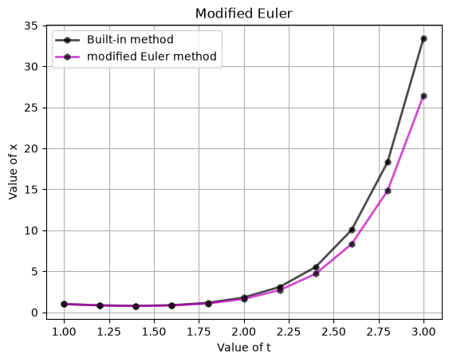
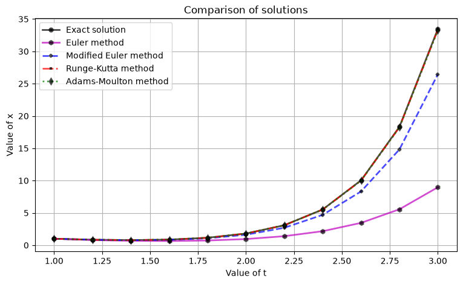

# Ordinary Differential Equations (ODE) Solver

This Python script provides a comparative analysis of various numerical methods for solving ordinary differential equations (ODEs). The implemented methods include Euler method, Modified Euler method, Runge-Kutta method, and Adams-Moulton method. The comparison is done against the exact solution of a sample ODE.

## Overview

This project implements and compares four common numerical methods for solving ODEs:

*   **Euler Method**: A first-order numerical procedure for solving ODEs with a given initial value. It is the most basic explicit method for numerical integration of ordinary differential equations.
*   **Modified Euler Method**: An improvement over the basic Euler method, this second-order method provides better accuracy by using a predictor-corrector approach.
*   **Runge-Kutta Method**: A fourth-order method that is widely used for its accuracy and stability. It involves calculating four different slopes at each step to approximate the solution.
*   **Adams-Moulton Method**: A multi-step method known for its high accuracy and efficiency, particularly for smooth problems. It uses a combination of explicit and implicit steps to achieve better results.

The script visualizes the results using `matplotlib`, generating plots that compare the numerical solutions with the exact solution and plots that show the absolute errors of each method. It also outputs the results in a tabular format for detailed analysis.

## How to Use

1.  **Installation**: Make sure you have the required Python libraries installed.

    ```bash
    pip install numpy matplotlib pandas
    ```

2.  **Input Parameters**: Open the `solve_DE.py` script and set the following parameters at the beginning of the file:

    *   `t0`: Initial time
    *   `x0`: Initial value of the function `x(t)`
    *   `z0`: Initial value of the derivative `z(t) = x'(t)`
    *   `tn`: Final time
    *   `h`: Step size

3.  **Running the Script**: Execute the script in a Python environment.

    ```bash
    python solve_DE.py
    ```

4.  **Viewing the Output**: The script will generate several plots:
    *   A comparison of each numerical solution with the exact solution.
    *   The absolute error for each numerical method.
    *   A combined plot showing all numerical solutions against the exact solution.

    Additionally, the script will print data tables with the exact solutions, numerical solutions, and absolute errors for each method.

## Code Structure

The four numerical methods live in [`numerical_methods.py`](numerical_methods.py), separate from the plotting/printing script, so they can be imported and tested on their own:

*   `euler_method()`: Implements the Euler method for solving the ODE.
*   `modified_euler_method()`: Implements the Modified Euler (Heun's / RK2 predictor-corrector) method.
*   `runge_kutta_method()`: Implements the fourth-order Runge-Kutta method.
*   `adams_moulton_method()`: Implements the Adams-Moulton method.
*   `exact_solution()`: The known closed-form solution to the demonstration ODE.

`solve_DE.py` imports these and adds the presentation layer:

*   `show_plot()`: Displays a plot comparing the exact solution with a single numerical method.
*   `print_info()`: Prints the coordinates and solution values for a given method.
*   `calc_absolute_error()`: Calculates the absolute error between the exact solution and a numerical solution.
*   `create_only_plot_error()`: Displays a plot of the absolute error for a single numerical method.
*   `show_all_plots()`: Displays a combined plot comparing all numerical solutions with the exact solution.

The main part of the script initializes the parameters, calls the numerical methods, and then generates the plots and data tables.

## Tests

`tests/test_convergence.py` empirically verifies each method's theoretical order of accuracy (Euler ≈ 1, Modified Euler ≈ 2, Runge-Kutta ≈ 4) by halving the step size and checking the global error shrinks by roughly the predicted factor. Run with:

```bash
pip install pytest
PYTHONPATH=. pytest tests/
```

**Writing this test found and fixed a real bug**: the original `modified_euler_method` had its midpoint offsets for `x` and `z` swapped (both used `z`'s own derivative instead of each variable using the other's), which silently broke the method's defining second-order convergence -- the observed order was ~0.8, not ~2. It's fixed now (see the function's docstring and the git history for details), and the example plots below were regenerated after the fix.

## Sample output

Running `solve_DE.py` produces plots like these (from [`images/`](images/)):

| Modified Euler vs. exact | All methods compared |
|---|---|
|  |  |

## Disclaimer

The accuracy of the numerical solutions may vary depending on the specific ODE, the step size `h`, and the chosen method. It is recommended to analyze the generated plots and tables to understand the behavior and limitations of each numerical method.

## Contributing

Contributions are welcome! If you have any suggestions for improvements or new features, feel free to open an issue or submit a pull request.
